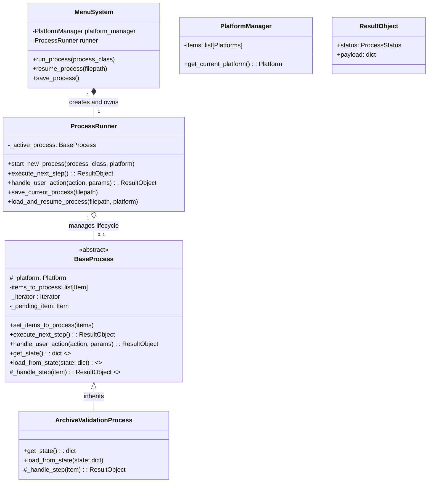
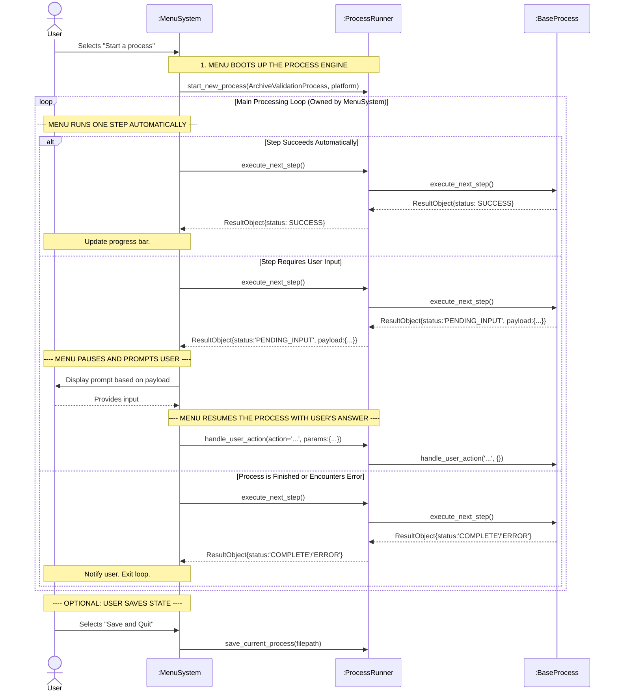

# Agent Guidelines for slupdate

## Build & Test Commands
- **Install dependencies**: `pip install -r requirements.txt`
- **Run application**: `python slupdate.py`
- **Run all tests**: `python -m pytest`
- **Run specific test file**: `python -m pytest tests/unit/processing/test_models.py`
- **Run specific test function**: `python -m pytest tests/unit/processing/test_models.py::TestResultObject::test_create_success_with_payload`
- **Run tests with coverage**: `python -m pytest --cov=rom_management --cov-report=term-missing --cov-report=html`
- **Linting**: PyLance is used in VSCode

## Code Style Guidelines

### Python Version & Imports
- **Python 3.7+** minimum (enforced in slupdate.py:22)
- Use **relative imports** for local modules (`from menus import MainMenu`)
- Standard library imports first, then third-party, then local
- Avoid multiple imports per line (`import os, sys` is acceptable)

### Formatting & Documentation  
- Use **triple-quoted docstrings** for all public functions/classes
- Indent with 4 spaces (PEP 8)
- Line length: ~80 characters preferred but not strictly enforced
- **Type hints** encouraged where beneficial (`Optional[str]`, `: Platform`)

### Naming Conventions
- **snake_case** for functions/variables (`get_script_path()`)
- **PascalCase** for classes (`MainMenu`, `HandlerException`)
- **UPPER_CASE** for constants
- Descriptive names required (`platform_manager` over `pm`)

### Error Handling
- Use **custom exception hierarchy** from `rom_management/exceptions.py`
- Base: `HandlerException`, with specific types like `CHDAlreadyExistsException`  
- Include meaningful error messages and optional menu class names for recovery
- Wrap external dependencies (requests, filesystem) in try-catch blocks

### Project Structure
- **Modular design**: separate modules for CD processing, ROM management, UI menus
- **Handler pattern** for different media formats (cdrdao, clonecd, bincue)
- Configuration via user prompts through `inquirer` library


### **1. Project Overview & Refactoring Goal**

**Project:** A Python tool that compares MAME Software List XML files against Redump/NoIntro DATs to identify original media, build CHDs from user-owned files, and update the Software Lists.

**Refactoring Goal:** To refactor the codebase into a clean, object-oriented model with a strict separation of concerns. The primary objective is to decouple the user interface (currently a CLI using `inquirer`) from the core processing logic. This will make the system more maintainable and allow for future frontends (e.g., a web UI with Electron) to be developed easily.

### **2. The Current Problem to Solve**

The project has long-running processes (e.g., archive validation, CHD building) that sometimes require user interaction (e.g., "This DAT is missing a hash, scan the entire file?"). The current refactoring has stalled because there is no clean mechanism for a low-level class performing work to pause and "ask" the `MenuSystem` for input. Raising exceptions has proven problematic.

### **3. The Agreed Architectural Solution**

We have introduced a new class, `ProcessRunner`, to act as an intermediary between the UI (`MenuSystem`) and the business logic (`BaseProcess`). This will enforce a clear, one-way flow of information.

*   **`MenuSystem`:** Owns the main user interaction loop. It tells the `ProcessRunner` to execute steps and handles the results.
*   **`ProcessRunner`:** A "traffic cop" that manages the lifecycle of a single `BaseProcess` instance. It knows nothing about UI or WHAT is being processed.
*   **`BaseProcess`:** An abstract class containing the core logic for a long-running task. It manages its own state, including an iterator and any "pending" items.
*   **`ResultObject`:** A formal dataclass used for all communication. It is the *only* thing returned by process steps, providing a predictable and structured contract.

**Key Feature: Resumability**
To handle large datasets, processes will be stateful. The `BaseProcess` can serialize its entire state to a dictionary, which the `ProcessRunner` can save to a file. This allows users to quit and resume a long-running process later.

### **4. Architecture Diagrams**

#### **Diagram 1: Class Diagram**



#### **Diagram 2: Execution Flow (Sequence Diagram)**



### **6. Recommended Order of Implementation**

To ensure the project is testable and builds incrementally, follow this order:

1.  **Foundation (Testable):** Create `ProcessStatus` Enum and `ResultObject` dataclass.
    *   Write simple unit tests for `ResultObject`'s helper methods (`.is_success()`, `.requires_input()`, etc.).

2.  **Skeleton Logic (Testable):** Update the current `BaseProcess` abstract class with its iterator and state management. Also, create a simple mock process like `MockSuccessProcess` that just returns `SUCCESS` for N items and then `COMPLETE`.
    *   Write a test that instantiates the mock process, calls `execute_next_step` in a loop, and verifies it returns the expected sequence of results.

3.  **The Engine (Testable):** Create `ProcessRunner`.
    *   Write a test that uses the `MockSuccessProcess`. Verify that `ProcessRunner` correctly instantiates and runs the process, acting as a simple pass-through.

4.  **UI Orchestration (Manual/Mock Test):** Implement the main loop in `MenuSystem` and the `BaseMenu` query mapping.
    *   Manually test with the mock processes. First, use `MockSuccessProcess` to see if progress flows automatically.
    *   Then, create a `MockPendingProcess` that returns `PENDING_INPUT` to test the prompt mechanism.

5.  **Real Implementation:** With the entire framework proven to work, you can now write the actual logic for `ArchiveValidationProcess`, `CHDBuildProcess`, etc., by implementing their specific `_handle_step` methods.

### **7. Multi-Phase Refactoring Plan**

This is a multi-phase project to refactor the entire process handling system. The goal is to migrate from exception-based control flow to ResultObject-based communication between UI (MenuSystem) and business logic (Process/BaseProcess).

**Overall Goal:** Refactor ALL legacy code into the new object model:
- Get core long-running processes working (ArchiveValidation, CHDBuildProcess)
- Refactor SoftwareList updating code (currently only reading is refactored)
- Complete all automated and semi-manual mapping between DATs and SoftwareLists
- Implement all special handlers from legacy CHD building function

**Completed Phases:**
- ✅ Phase 1 & 2: ProcessRunner, BaseProcess, ResultObject, ArchiveValidation
- ✅ Phase 3A: MenuSystem ResultObject-only navigation
- ✅ Phase 3B: Concrete Process Migration (CHDBuildProcess)
- ✅ Phase 3C: Bug Fixes & Process Flow Improvements

**Pending Phases:**
- ⏳ Phase 4: Cleanup & Migration (remove ProcessManager, legacy code)

---

### **7A. Phase 3A: MenuSystem ResultObject-Only Navigation** ✅ COMPLETE

As of [December 2025], all action functions now return ResultObject. Legacy navigation methods have been removed from MenuSystem, eliminating the dual navigation paths.

**Changes Made:**

1. **All Action Functions Updated** (`menus/mapping.py`)
   - Created utility function `handle_unimplemented_function()` to catch AttributeError exceptions
   - Updated 11 action functions in MapMenu, MapStageTwo, MapStageThree to return ResultObject
   - Helper functions (`process_interactive_matches`, `automated_mapping`) wrapped in try/except
   - Functions accessing old dict structures now gracefully return ResultObject.complete(total_processed=0) with informative error messages

2. **MenuSystem Simplified** (`menus/menu_system/menus.py`)
   - **Removed:** `_handle_dict_navigation()` method
   - **Removed:** `_legacy_navigate_to()` method
   - **Simplified:** `MenuItem.execute()` - removed legacy type checking for dict/str/None returns
   - **Added:** `_navigate_to_menu()` helper method - centralized navigation logic
   - **Updated:** `navigate_to()` - only handles ResultObject, no else branch
   - **Updated:** All references to `_legacy_navigate_to()` now use `_navigate_to_menu()`

**Status:**
- ✅ All action functions return ResultObject
- ✅ Legacy navigation methods removed
- ✅ Single navigation path enforced
- ✅ Ready for future Platform class refactoring

**Next Steps for Refactor:**
- Complete 3B and 4 of Current Refactoring phase
- Plan the next phase of refactoring for full read/write for Softlist and DAT data (currently read only)
- Plan the final phase of refactoring all mapping functions
    - when complete all action functions should be using Platform class or ProcessRunner methods
    - These functions will fail gracefully with informative messages until refactoring is complete
    - See `[NOT IMPLEMENTED]` messages in output for functions that need Platform class updates

---

### **7B. Phase 3B: Concrete Process Migration** ✅ COMPLETE

**Status**: CHDBuildProcess and ArchiveValidationProcess are both fully functional using the ResultObject pattern. Users can validate ROMs and build CHDs with proper handling of edge cases (missing hashes, existing CHD files, etc.).

**Key Achievements:**
- ✅ ArchiveValidationProcess: Validates ROM archives against DATs, handles missing hash scenarios
- ✅ ChdBuildProcess: Builds CHDs from validated media, handles existing CHD files
- ✅ ProcessRunner: Manages process lifecycle and state preservation
- ✅ Query menus: Properly display options and capture user actions
- ✅ ResultObject flow: Clean, predictable communication between UI and business logic

---

### **7C. Bug Fixes & Process Flow Improvements** ✅ COMPLETE

Two critical bugs were discovered and fixed during testing:
1. **Duplicate execution** - Process first step was executing twice
2. **None handling** - Query menus weren't displaying when processes required user input

Both bugs were fixed by following existing proven patterns in the codebase. Integration tests were added to prevent regressions. Key lessons are documented in Section 9 (Developer Preferences & Best Practices).

---

### **7D. Phase 4: Cleanup & Migration** ✅ COMPLETE

*Remove ProcessManager and finalize migration to new object model.*

**Changes Made:**

1. **Removed ProcessManager from Platform** (`consoles/console.py`)
   - Removed `ProcessManager` import
   - Removed `self.process_manager` attribute
   - Removed method: `start_validation_process()`
   - Removed method: `start_chd_build_process()` (was calling non-existent method)
   - Removed method: `validate_matched_entries()` (~70 lines)
   - Removed method: `build_chds_for_matched()` (~115 lines)

2. **Cleaned Up Old Menu Functions** (`menus/chd_menus.py`)
   - Removed menu option: "a. Validate source ROMs (old method)"
   - Removed method: `_validate_roms_old()`
   - Kept: `old_chd_builder()` function (reference for dict-based code)

3. **Deleted ProcessManager File**
   - Deleted: `rom_management/processing/process_manager.py` (119 lines)

4. **Updated Processing Module Exports** (`rom_management/processing/__init__.py`)
   - Removed `ProcessManager` from imports and `__all__`

5. **Cleaned Up Exception Classes** (`rom_management/exceptions.py`)
   - Removed: `HandlerException` (base class for old UI exceptions)
   - Removed: `UserActionRequiredException` (old exception for MenuSystem navigation)
   - Removed: `SkipCurrentItemException` (old exception for MenuSystem navigation)
   - Removed: `StopProcessingException` (appears unused)
   - Kept: `CHDAlreadyExistsException` (used by new code for internal process control)

6. **Updated Handler Base Class** (`rom_management/handlers/base.py`)
   - Removed deprecated method: `_requires_user_intervention()`
   - Removed deprecated method: `_should_skip_item()`
   - Removed deprecated method: `get_menu_name()`
   - Removed deprecated docstrings from `execute_action()` and `execute()`

7. **Updated MD5 Handler** (`rom_management/handlers/md5_handler.py`)
   - Removed deprecated method: `_requires_user_intervention()`

8. **Created Platform Unit Tests** (`tests/unit/consoles/test_platform.py`)
   - Comprehensive tests for Platform class after major refactoring
   - Tests cover: initialization, state management, CHD preferences, properties, handlers, DAT management

9. **Updated Models** (`rom_management/processing/models.py`)
   - Removed TYPE_CHECKING import: `from rom_management.exceptions import HandlerException`

**Items Left for Future Discussion:**
- **Handler Registry** (`rom_management/handlers/registry.py`)
  - Contains `register_special_handler()` and `get_special_handlers()` methods
  - These methods were used by ProcessManager for dynamic handler loading
  - Current new architecture doesn't use these methods (handlers are registered via imports in `__init__.py`)
  - Need to discuss: Should these be removed, or are they needed for future extensibility?

---

## Current Architecture Status

**Completed Components:**
- ✅ ProcessRunner (`rom_management/processing/process_runner.py`)
- ✅ BaseProcess (`rom_management/processing/base_process.py`)
- ✅ ResultObject & Action Enum (`rom_management/processing/models.py`)
- ✅ ArchiveValidationProcess (`rom_management/processing/archive_validation.py`)
- ✅ ChdBuildProcess (`rom_management/processing/chd_build_process.py`)
- ✅ MenuSystem ResultObject-only navigation (`menus/menu_system/menus.py`)
- ✅ DeclarativeMenuAdapter & DynamicMenuAdapter (`menus/menu_system/adapters.py`)
- ✅ All action functions return ResultObject (`menus/mapping.py`)
- ✅ GenericQueryMenu for process queries (`menus/query_menus.py`)
- ✅ Process flow bug fixes (duplicate execution, None handling)
- ✅ Integration tests for menu/process flow
- ✅ **Phase 4 Cleanup**: Removed ProcessManager, legacy code, exceptions, deprecated methods
- ✅ Platform unit tests (`tests/unit/consoles/test_platform.py`)

**Pending Components:**
- ⏳ Action functions refactored to use Platform class methods
- ⏳ SoftwareList update code refactoring (currently read-only)
- ⏳ Full read/write for Softlist and DAT data
- **Handler Registry** (`rom_management/handlers/registry.py`) - pending discussion (see notes above)

---

### **8. Multi-Phase Refactoring Plan Summary**

| Phase | Description | Status |
|--------|-------------|--------|
| 1 | Foundation: ProcessStatus Enum, ResultObject dataclass | ✅ Complete |
| 2 | Skeleton: BaseProcess with iterator & state management | ✅ Complete |
| 3A | MenuSystem cleanup & adapter pattern | ✅ Complete |
| 3B | Concrete processes: ChdBuildProcess, handlers | ✅ Complete |
| 3C | Bug fixes & process flow improvements | ✅ Complete |
| 4 | Cleanup: Remove ProcessManager, legacy code | ✅ Complete |

**Key Architectural Decisions:**
1. **ResultObject-only communication** - All process/UI interactions use ResultObject
2. **Action enum for commands** - Replaces string-based action identifiers
3. **Adapter pattern for menus** - DeclarativeMenuAdapter & DynamicMenuAdapter
4. **Handler pattern for media** - Specialized handlers for CD formats
5. **ProcessRunner as intermediary** - Clear separation between UI and business logic

---

### **What's Next?**

Priority order (choose based on what you want to work on):

1. **Phase 4: Cleanup** - Remove ProcessManager and all legacy exception-based code
   - Remove ProcessManager usage from Platform class
   - Remove `rom_management/processing/process_manager.py`
   - Clean up any remaining exception-based menu handling

2. **Action Functions** - Refactor to use Platform class methods
   - Replace dict access (`software_list_data`, `dat_hashes`) with Platform methods
   - This completes the menu system migration to ResultObject pattern

3. **SoftwareList Update Code** - Refactor writing/updating Software Lists
   - Currently only reading is refactored, writing is still exception-based
   - Move update logic into ResultObject-based processes
   - Large, complex undertaking - separate project from core processing

4. **Full read/write for Softlist and DAT data** - Add write capabilities
   - Currently refactored code is read-only
   - Add methods to Platform class for updating Software Lists and DATs
   - Enable automated mapping updates

**Suggested Approach:**
- Start with Phase 4 (cleanup) to simplify codebase
- Action functions refactoring builds on cleanup
- SoftwareList updating is a separate major project
- Each phase can be completed independently
- Test incrementally as you go

---

### **9. Developer Preferences & Best Practices**

This section documents developer preferences and patterns that have emerged during the refactoring process.

#### **Prefer Simple Solutions Over Complex Patterns**

**Principle**: When fixing bugs or implementing features, prefer simple, proven patterns over introducing new abstractions.

**Example**: When the `run_process()` → `None` handling issue was discovered, a new `STAY` status was considered. However, the simple solution (following the existing `_validate_roms()` pattern) was preferred and implemented instead.

**Benefits**:
- Easier to understand and maintain
- Less code to test and debug
- Follows existing patterns in the codebase

#### **Follow Existing Proven Patterns**

**Principle**: Look for working examples in the codebase and follow the same pattern.

**Example**: When implementing `_chd_builder()`, the working `_validate_roms()` pattern was copied:
```python
# Correct pattern from _validate_roms():
result = menu_system.run_process(ArchiveValidationProcess, ...)
if result is None:
    return ResultObject.success(message="Waiting for user input...")
return result
```

**Benefits**:
- Reduces cognitive load
- Leverages existing battle-tested code
- Maintains consistency across the codebase

#### **Add Tests to Prevent Future Bugs**

**Principle**: When fixing bugs, add tests that prevent regression.

**Example**: After fixing the None handling bug, three integration tests were added to document the correct pattern:
1. `test_menu_item_handles_none_from_run_process`
2. `test_menu_item_wraps_none_prevents_bug`
3. `test_chd_builder_pattern_description`

**Benefits**:
- Documents the correct pattern for future developers
- Catches regressions early
- Serves as inline documentation

#### **The Critical run_process() Pattern**

**Principle**: All menu items that call `run_process()` must wrap the result and handle `None`.

**Why**: When a process encounters `PENDING_INPUT`:
1. `run_process()` calls `navigate_to(result)` to show the query menu
2. `run_process()` returns `None` to indicate "waiting for user"
3. The `None` must be caught and converted to `ResultObject.success()` by the calling menu item
4. If not caught, `MenuItem.execute()` treats `None` as "no action" and navigates away

**Correct Pattern**:
```python
def my_menu_action(platform, menu_system):
    result = menu_system.run_process(SomeProcess, destination_menu="some_menu")
    if result is None:
        return ResultObject.success(message="Waiting for user input...")
    return result
```

**This preserves process state in `runner._active_process`** so that when the user selects an action from the query menu, `resume_process()` can continue from where it left off.

#### **Test Incrementally**

**Principle**: Test at every step, not just at the end.

**Example**:
- Unit tests for `ResultObject` helper methods
- Unit tests for `ProcessRunner` with mock processes
- Integration tests for menu/process flow
- Manual testing with real data

**Benefits**:
- Catches issues early when they're cheaper to fix
- Provides confidence in refactoring
- Documents expected behavior

---

### **10. Files to Reference for Future Work**

**Key Files**:
- **Menu system**: `menus/menu_system/menus.py` (lines 366-458)
- **CHD menu**: `menus/chd_menus.py` (lines 247-296)
- **Process runner**: `rom_management/processing/process_runner.py`
- **Base process**: `rom_management/processing/base_process.py`
- **Models**: `rom_management/processing/models.py` (ResultObject, Action enum)
- **Test pattern**: `tests/integration/test_menu_item_and_handler_flow.py` (for documentation)
- **Working example**: `menus/chd_menus.py` `_validate_roms()` (lines 221-237)

**Pre-existing Issues** (noted during testing):
- `test_progress_property` in `tests/integration/test_archive_validation.py` fails (expects 3 processed but gets 5) - this was failing before the Phase 3C bug fixes and is unrelated to the refactor work


