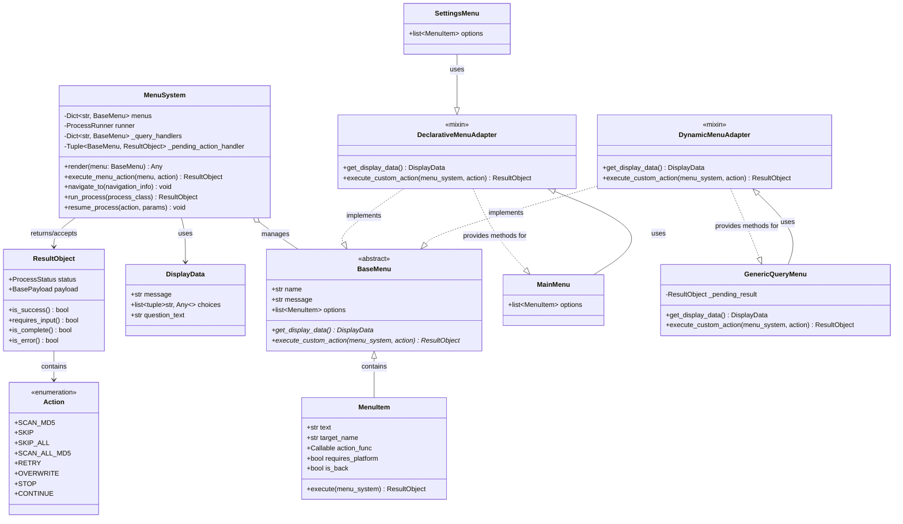
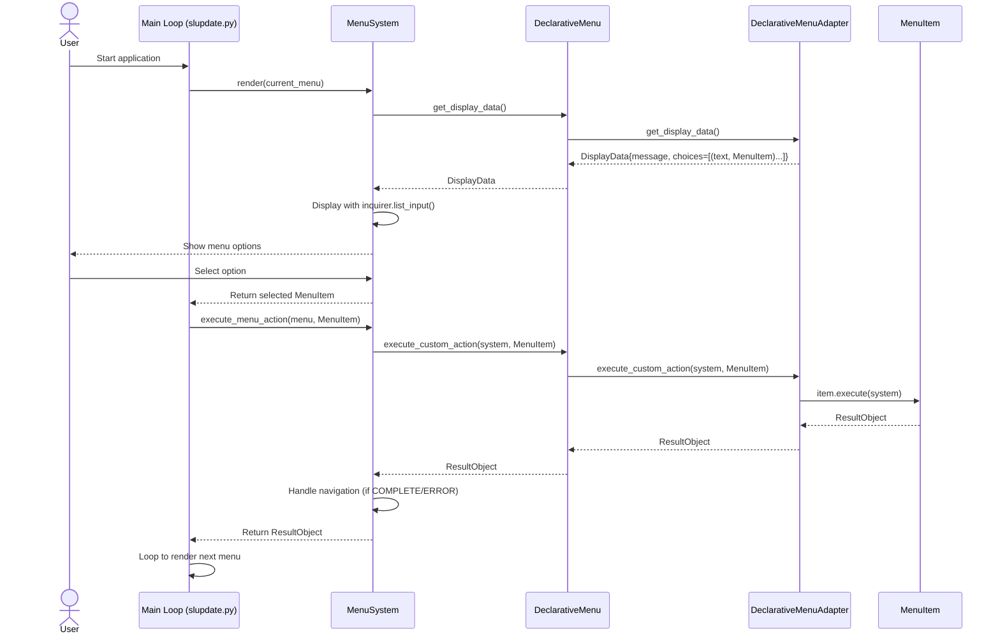
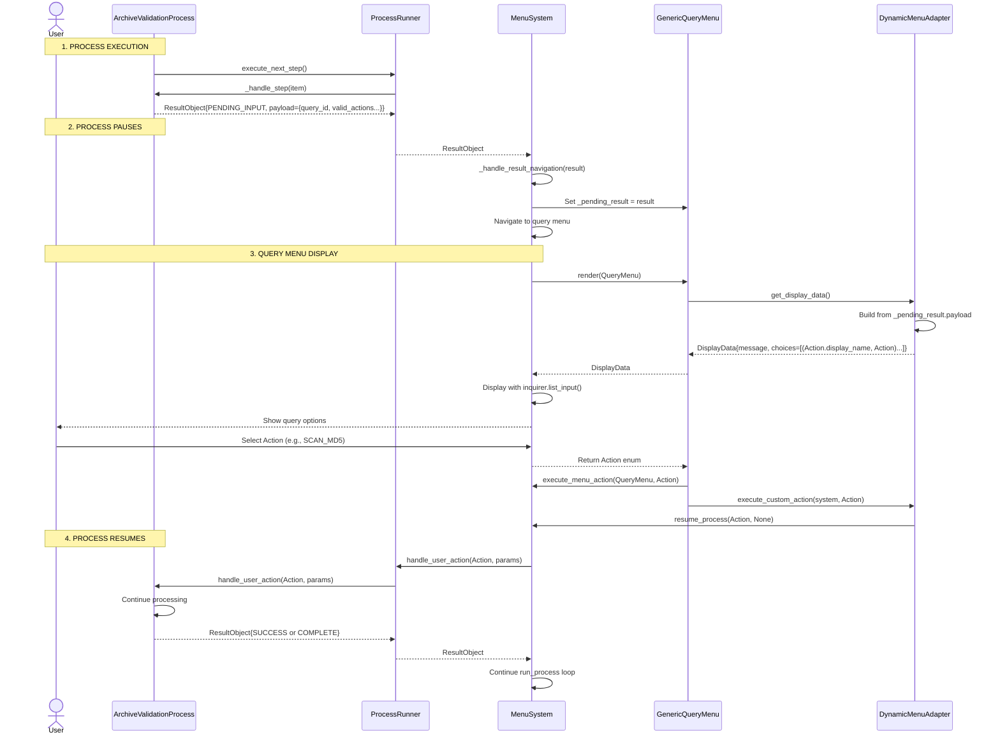

# MenuSystem Architecture Refactoring

## Overview

This document describes the refactored MenuSystem architecture that unifies declarative menus (MainMenu, SettingsMenu, etc.) and dynamic menus (query menus from processes) under a single interface.

**Goal**: Eliminate dual execution paths, centralize rendering logic, and prepare for future web UI implementation.

## Core Concepts

### Menu Types

1. **Declarative Menus**: Menus with static `MenuItem` options defined at class level
   - Examples: MainMenu, SettingsMenu, MapMenu, CHDBuildMenu
   - Good for: Static navigation menus with predefined options
   - Data source: `self.options` (list of MenuItem objects)

2. **Dynamic Menus**: Menus generated at runtime from process results
   - Examples: GenericQueryMenu (for MD5 scan prompts, etc.)
   - Good for: User interaction during long-running processes
   - Data source: `ResultObject.pending_input()` with `PendingInputPayload`

### Key Components

```
DisplayData          -> UX-specific data structure for rendering
BaseMenu             -> Abstract base for all menus
MenuSystem           -> Orchestrates navigation and rendering
DeclarativeMenuAdapter   -> Mixin for MenuItem-based menus
DynamicMenuAdapter     -> Mixin for process-based menus
```

## Class Diagram



## Execution Flow Diagrams

### Declarative Menu Flow (MainMenu, SettingsMenu, etc.)



### Dynamic Menu Flow (GenericQueryMenu for process queries)



## Implementation Details

### DisplayData Structure

```python
@dataclass
class DisplayData:
    """Data needed to render a menu to the user.

    This is format-agnostic - could be rendered by:
    - Current: inquirer CLI
    - Future: React web UI (return as JSON)
    - Future: Other frontend frameworks

    Attributes:
        message: The main message/title to display
        choices: List of (display_name, value) tuples
        question_text: The prompt text for user selection
    """
    message: str
    choices: list[Tuple[str, Any]]
    question_text: str = "What would you like to do?"
```

### BaseMenu Interface

```python
class BaseMenu(ABC):
    """Base class for all menus.

    All menus must implement:
    - get_display_data(): Returns DisplayData for rendering
    - execute_custom_action(): Handles user action from menu

    This allows MenuSystem to render all menus the same way
    without knowing menu implementation details.
    """

    @property
    def options(self) -> list[MenuItem]:
        """Declarative menus: list of MenuItem objects"""
        pass

    @abstractmethod
    def get_display_data(self) -> DisplayData:
        """Return display data for rendering by MenuSystem."""
        pass

    @abstractmethod
    def execute_custom_action(
        self,
        menu_system: "MenuSystem",
        action: Any
    ) -> ResultObject:
        """Execute a user action selected from the menu."""
        pass
```

### DeclarativeMenuAdapter Implementation

```python
class DeclarativeMenuAdapter:
    """Adapter for MenuItem-based declarative menus.

    Usage:
        class MainMenu(DeclarativeMenuAdapter, BaseMenu):
            def __init__(self):
                super().__init__("main_menu")
                self.options = [
                    MenuItem(text="Settings", target="settings_menu"),
                    ...
                ]

            # No need to implement get_display_data() or execute_custom_action()
            # Adapter provides the implementation!
    """

    def get_display_data(self) -> DisplayData:
        """Convert MenuItem.options to DisplayData."""
        choices = [(item.text, item) for item in self.options]
        return DisplayData(message=self.message, choices=choices)

    def execute_custom_action(
        self,
        menu_system: "MenuSystem",
        action: Any
    ) -> ResultObject:
        """Execute a MenuItem action."""
        if isinstance(action, MenuItem):
            return action.execute(menu_system)
        raise ValueError(f"Expected MenuItem, got {type(action)}")
```

### DynamicMenuAdapter Implementation

```python
class DynamicMenuAdapter:
    """Adapter for dynamic query menus from process results.

    Usage:
        class GenericQueryMenu(DynamicMenuAdapter, BaseMenu):
            def __init__(self):
                super().__init__("generic_query_menu")
                self._pending_result = None

            # No need to implement get_display_data() or execute_custom_action()
            # Adapter provides the implementation!

        # MenuSystem sets _pending_result before navigating to this menu
        menu._pending_result = ResultObject.pending_input(
            query_id="md5_scan",
            message="Hash missing - scan entire file?",
            item=ProcessingItem(...),
            valid_actions=[Action.SCAN_MD5, Action.SKIP]
        )
    """

    def get_display_data(self) -> DisplayData:
        """Convert PendingInputPayload to DisplayData."""
        if not hasattr(self, "_pending_result") or not self._pending_result:
            return DisplayData(message="No pending query", choices=[])

        payload = self._pending_result.payload
        choices = [(act.display_name, act) for act in payload.valid_actions]

        message = payload.message
        if hasattr(payload.item, "display_name"):
            message += f"\nItem: {payload.item.display_name}"

        return DisplayData(message=message, choices=choices)

    def execute_custom_action(
        self,
        menu_system: "MenuSystem",
        action: Any
    ) -> ResultObject:
        """Resume process with user's action."""
        menu_system.resume_process(action, None)
        return ResultObject.success()
```

### MenuSystem Rendering

```python
class MenuSystem:
    """Manages navigation state and history with platform integration."""

    def render(self, menu: BaseMenu) -> Any:
        """
        Display menu and return selected action/value.

        This method centralizes ALL rendering logic for menus.

        In the future, this could be replaced with web UI API endpoints
        that return DisplayData as JSON.
        """
        display_data = menu.get_display_data()

        print(f"\n{display_data.message}")

        import inquirer
        questions = [
            inquirer.List(
                "action",
                message=display_data.question_text,
                choices=display_data.choices,
            )
        ]

        answers = inquirer.prompt(questions)
        return answers["action"]

    def execute_menu_action(
        self,
        menu: BaseMenu,
        action: Any
    ) -> ResultObject:
        """
        Execute a menu action and handle navigation.

        Delegates execution to menu's execute_custom_action(),
        then handles navigation based on ResultObject.
        """
        result = menu.execute_custom_action(self, action)

        if result.is_complete() or result.is_error():
            self.navigate_to(result)

        return result
```

## Testing

### Unit Test Structure

```python
def test_menu_get_display_data():
    """Test that menu returns DisplayData via adapter"""
    menu = MainMenu()
    display_data = menu.get_display_data()

    assert display_data.message == "Main Menu"
    assert len(display_data.choices) == 5
    assert display_data.question_text == "What would you like to do?"

def test_menu_execute_custom_action():
    """Test that menu executes MenuItem actions via adapter"""
    menu = MainMenu()
    system = Mock(spec=MenuSystem)
    result = menu.execute_custom_action(system, menu.options[0])

    assert result.is_complete() or result.is_success()
```

### Integration Test Structure

```python
def test_query_menu_with_process():
    """Test that query menu integrates with process execution"""
    # Setup
    system = MenuSystem()
    system.runner = ProcessRunner(mock_platform)
    system.runner.start_new_process(ArchiveValidationProcess)

    # Execute step that triggers query
    result = system.runner.execute_next_step()
    assert result.requires_input()

    # Navigate to query menu
    system.navigate_to(result)
    assert system.current_menu_name == "generic_query_menu"

    # Simulate user action
    system.resume_process(Action.SCAN_MD5, None)

    # Verify process resumed
    final_result = system.runner.execute_next_step()
    assert final_result.is_success()
```

